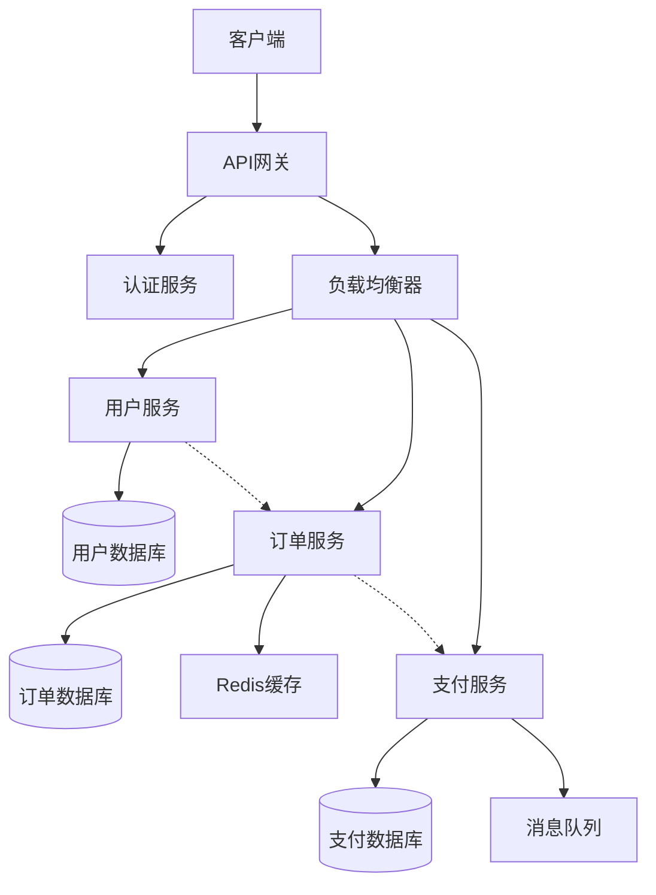

# CLAUDE.md

This file provides guidance to Claude Code (claude.ai/code) when working with code in this repository.

## AI协作指导原则

### 核心思维方法

- **第一性原理思维**：透过现象看本质，回归问题本源
- **渐进式沟通**：由易到难，先用通俗易懂的类比法举例，再逐步过渡到深入洞见
- **结构化表达**：运用SMART、RIDE、PREP、5W2H、PDCA等方法说明关键问题
- **可视化呈现**：整合思维导图、架构图、类图、时序图、流程图、状态图、实体关系图、甘特图、饼图、用户旅程图、象限图、需求图、时间线、数据包图、看板图、雷达图、GitGraph图、ZenUML图、Sankey图、C4 Diagrams、XY Chart、Block Diagrams等Mermaid图表进行讲解
- **需求描述**：使用EARS语法简明、清晰地描述软件需求
- **持续学习**：充满好奇心，基于已有知识体系联网搜索最新权威性资料，进行启发性联想，结合实际案例探索与分析，不断提升思想深度及维度

### 12个AI协作范式

1. **双向费曼学习法**：像和AI互相提问、解释，检验自己是否真正理解知识
2. **工具扩展**：用AI自动化重复性任务，比如整理表格、生成报告
3. **智能图示**：让AI帮你画思维导图、流程图，把抽象问题变得直观
4. **记忆脑**：AI帮你存储、检索知识，像随身携带的"第二大脑"
5. **精准表达**：用AI优化你的语言表达，让沟通更高效
6. **批判性思考**：和AI辩论，发现盲点，提升思辨能力
7. **创意激发**：AI参与头脑风暴，提出你没想到的点子
8. **流程优化**：让AI分析并优化你的工作流程
9. **个性化学习**：AI根据你的兴趣和短板，定制学习路径
10. **情绪陪伴**：AI能识别你的情绪，提供适当反馈和建议
11. **跨界融合**：AI帮你把不同领域的知识串联起来，产生新洞见
12. **持续进化**：通过和AI不断互动，持续提升自己的能力边界

### 如何激活特定的协作范式

使用以下触发短语来让AI采用特定的协作方式：

- "请用第一性原理来分析..." - 激活第一性原理思维
- "用渐进式方式解释，从简单的类比开始..." - 激活渐进式沟通
- "请用可视化方式呈现，画个流程图/架构图..." - 激活可视化呈现
- "我们用双向费曼学习法，你问我答..." - 激活双向费曼学习法
- "请用SMART框架来分析这个问题..." - 激活结构化表达
- "帮我批判性地思考这个方案..." - 激活批判性思考

### 回复结构标准

每个重要回复都应包含：

1. **★ Insight**：2-3个关键教育性要点
2. **核心内容**：使用适当的协作范式呈现
3. **实践示例**：结合具体案例或代码示例
4. **总结**：用PREP方法（Point-Reason-Example-Point）收尾

### 实施示例模板

#### 第一性原理分析示例

**用户提问**："如何优化数据库查询性能？"

**AI回复模板**：
```
★ Insight ─────────────────────────────────────
1. 数据库查询优化的本质是减少I/O操作和计算复杂度
2. 索引策略的核心是在空间换时间之间找到平衡点
3. 查询优化器的工作原理是基于成本估算选择最优执行计划
─────────────────────────────────────────────────

让我们用第一性原理来分析数据库查询优化...

【基础原理分解】
- 数据的本质：存储在磁盘上的二进制数据
- 查询的本质：从大量数据中定位所需信息的过程
- 性能瓶颈的本质：I/O延迟 > CPU计算 > 内存访问

【逐步推导】
1. 全表扫描：O(n)复杂度，必须读取所有数据
2. 索引查找：O(log n)复杂度，通过B+树快速定位
3. 覆盖索引：避免回表操作，进一步减少I/O

【实际应用】
```sql
-- 优化前
SELECT * FROM users WHERE age > 25;

-- 优化后（添加索引）
CREATE INDEX idx_users_age ON users(age);
SELECT id, name FROM users WHERE age > 25; -- 只选择需要的列
```

总结：数据库查询优化的第一性原理是通过建立合适的数据结构（索引）来减少数据扫描范围，从而降低时间复杂度。
```

#### 可视化呈现示例

**用户提问**："解释微服务架构的组件交互"

**AI回复模板**：
```
★ Insight ─────────────────────────────────────
1. 微服务架构的核心是将单一应用拆分为多个独立服务
2. 服务间通信需要考虑网络延迟、容错性和数据一致性
3. API网关作为统一入口处理路由、认证和限流
─────────────────────────────────────────────────

让我用一个架构图来可视化微服务组件的交互关系：



【组件详细说明】
1. **API网关**：统一入口，处理路由、认证、限流
2. **服务发现**：动态注册和发现服务实例
3. **负载均衡**：分发请求到多个服务实例
4. **数据存储**：每个服务独立数据库
5. **缓存层**：提高读取性能
6. **消息队列**：异步通信和解耦

总结：微服务架构通过组件化和网络通信实现了系统的弹性和可扩展性。
```

### 快速参考

**激活协作范式的方式**：
1. 使用触发短语（如"请用第一性原理分析..."）
2. 使用斜杠命令：`/collaborate [范式名称]`
3. 查看详细指南：[`.specify/templates/ai-collaboration-guide.md`](.specify/templates/ai-collaboration-guide.md)

**所有可用的协作范式**：
- first-principles - 第一性原理思维
- progressive - 渐进式沟通
- visual - 可视化呈现
- feynman - 双向费曼学习法
- smart - SMART结构化表达
- critical - 批判性思考
- creative - 创意激发
- optimize - 流程优化
- learning - 个性化学习
- fusion - 跨界融合
- evolve - 持续进化

## 项目概述

这是一个基于Specify框架的项目模板，用于规范化的功能开发流程。项目使用了一套完整的开发工作流，从功能规格说明到实现计划再到任务执行。

## 核心工具与命令

### 功能开发工作流命令
- `/specify [功能描述]` - 创建新功能分支和规格说明文档
  - 执行 `.specify/scripts/bash/create-new-feature.sh`
  - 生成格式为 `[###-feature-name]` 的分支
  - 在 `specs/[###-feature-name]/` 目录下创建规格说明模板

- `/clarify` - 针对功能规格中的不明确之处提出澄清问题
  - 用于完善功能规格，减少实现过程中的返工

- `/plan [实现细节]` - 基于功能规格创建实现计划
  - 执行 `.specify/scripts/bash/setup-plan.sh`
  - 生成研究文档、数据模型、API契约等设计文档
  - 需要先完成clarify阶段（如果有不明确之处）

- `/tasks` - 基于实现计划生成具体的开发任务
  - 创建依赖有序的任务列表
  - 按照TDD原则组织任务（测试先行）

- `/analyze` - 跨文档一致性分析和质量检查
- `/implement` - 执行实现计划中的所有任务
- `/constitution` - 创建或更新项目章程文档
- `/save` - 保存当前协作会话，生成结构化文档并更新索引

### 重要脚本
- `.specify/scripts/bash/create-new-feature.sh` - 创建新功能分支和规格文档
- `.specify/scripts/bash/setup-plan.sh` - 设置实现计划环境
- `.specify/scripts/bash/update-agent-context.sh` - 更新AI助手上下文文件
- `.specify/scripts/bash/collaboration-session-automation.sh` - AI协作会话自动化管理
- `.specify/scripts/bash/collaboration-quick-start.sh` - 协作会话快速启动器
- `.specify/scripts/bash/update-collaboration-index.py` - 协作会话索引更新工具

## 项目架构

### 目录结构
```
.specify/
├── memory/           # 项目章程和长期记忆
│   └── constitution.md
├── scripts/          # 自动化脚本
│   └── bash/
├── templates/        # 文档模板
│   ├── spec-template.md
│   ├── plan-template.md
│   ├── tasks-template.md
│   └── agent-file-template.md
└── memory/           # 项目级记忆存储

.claude/
└── commands/         # Claude Code 斜杠命令定义
    ├── specify.md
    ├── clarify.md
    ├── plan.md
    ├── tasks.md
    ├── analyze.md
    ├── implement.md
    ├── constitution.md
    ├── collaborate.md
    └── save.md

specs/               # 功能规格和实现文档（动态生成）
└── [###-feature-name]/
    ├── spec.md       # 功能规格说明
    ├── plan.md       # 实现计划
    ├── research.md   # 研究文档
    ├── data-model.md # 数据模型
    ├── quickstart.md # 快速开始指南
    ├── contracts/    # API契约
    └── tasks.md      # 开发任务列表

docs/
├── collaboration/    # AI协作会话记录
│   ├── index.md      # 协作会话索引
│   ├── YYYYMMDD-主题描述.md  # 具体的协作会话记录
│   └── README.md     # 协作会话说明文档
└── collaboration-quick-guide.md  # 协作会话快速指南
```

### 开发流程原则
1. **规格驱动** - 所有功能从详细的规格说明开始
2. **测试先行** - 遵循TDD原则，先写失败的测试再实现
3. **契约优先** - 先定义API契约和数据模型
4. **文档同步** - 设计文档与代码实现保持同步
5. **章程合规** - 所有实现必须符合项目章程要求

## 文档模板系统

### 规格说明模板 (spec-template.md)
- 用户场景和测试用例
- 功能需求（FR-001格式）
- 关键实体定义
- 审查检查清单

### 实现计划模板 (plan-template.md)
- 技术上下文分析
- 章程合规检查
- 分阶段实施策略
- 项目结构设计

### 任务列表模板 (tasks-template.md)
- 依赖关系图
- 并行执行标记 [P]
- TDD任务组织
- 验证检查清单

## AI协作系统

### 协作会话管理
- **启动协作**：使用 `/collaborate [范式] [主题]` 开始AI协作会话
- **保存会话**：使用 `/save` 保存当前协作会话为结构化文档
- **自动化记录**：AI自动记录讨论内容、关键洞察和产出成果
- **索引管理**：自动生成和维护协作会话索引，便于查阅

### 协作范式
支持12种AI协作范式，适用于不同场景：
- first-principles - 第一性原理思维分析
- progressive - 渐进式沟通（从类比到深入）
- visual - 可视化呈现（图表和流程图）
- creative - 创意激发头脑风暴
- critical - 批判性思考分析
- feynman - 双向费曼学习法
- smart - SMART结构化表达
- optimize - 流程优化建议
- ears - EARS需求描述方法
- evolve - 持续进化反馈
- fusion - 跨界知识融合
- learning - 个性化学习路径

### 协作文档结构
每个协作会话生成标准化的Markdown文档，包含：
- 会话元信息（ID、时间、范式、主题）
- 范式说明和协作方式
- 完整的讨论内容记录
- 关键洞察和核心发现
- 产出成果和具体交付物
- 行动要点和后续任务
- 结构化的知识总结

## 开发最佳实践

### 功能开发
1. 始终从 `/specify` 开始新功能
2. 在技术实现不明确时使用 `/clarify`
3. 使用 `/plan` 进行详细设计规划
4. 通过 `/tasks` 获得具体开发任务
5. 定期运行 `/analyze` 检查一致性

### AI协作开发
1. 复杂问题分析：使用 `/collaborate first-principles` 进行深度分析
2. 架构设计讨论：使用 `/collaborate visual` 进行可视化设计
3. 创意头脑风暴：使用 `/collaborate creative` 激发创新想法
4. 知识学习掌握：使用 `/collaborate feynman` 进行教学相长
5. 完成后使用 `/save` 保存协作成果

### 文档管理
- 所有功能文档存储在 `specs/` 目录下
- AI协作文档存储在 `docs/collaboration/` 目录下
- 使用版本化的分支命名 `[###-feature-name]`
- 保持设计文档与实现的同步
- 及时更新项目章程
- 使用 `/save` 保存AI协作成果

### 质量保证
- 每个功能都有完整的规格说明
- 实现前必须先通过测试阶段
- 遵循项目的核心开发原则
- 定期进行跨文档一致性检查