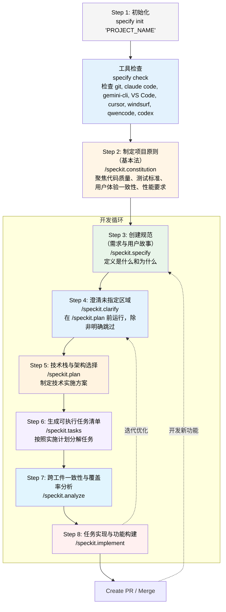

# SDD规范驱动开发
> SDD：Specification-Driven Development
## 权力反转
几十年来，代码一直是王者。规格说明书服务于代码：一旦开始“真正的编码工作”，规格说明书就是我们构建然后可丢弃的脚手架。我们编写 PRD 来指导开发，创建设计文档来告知实现，绘制图表来可视化架构。但这些始终都从属于代码本身。代码是真理。其他一切都是，充其量，只是好意。代码是真理的来源，随着它的推进，规格说明书很少能跟上步伐。由于资产（代码）与实现是一体的，若不尝试基于代码进行构建，就很难做到代码与规格说明书同步对齐。
规范驱动开发（SDD）反转了这种权力结构。规格说明书（规范）不是为代码服务——代码是为规范服务。产品需求文档（PRD）不是实施指南；它是生成实施的源头。技术计划不是告知编码的文档；它们是产生代码的精确定义。这不仅仅是我们构建软件方式的渐进式改进。更是对究竟什么才是驱动开发的本质的重新思考。
规范与实现之间的差距自软件开发伊始就困扰着行业。我们试图通过改进文档、更详细的需求描述、更严格的过程来弥合这一差距。但这些方法都失败了，因为它们将这一差距视为不可避免。它们试图缩小差距，却从未真正消除它。规范驱动开发（SDD）通过使规范及其具体实现计划成为可执行的形式来消除这一差距。当规范和实现计划生成代码时，便不再存在差距——只有转换。
这种转换之所以可能，是因为 AI 能够理解和实现复杂的规范，并创建详细的实现计划。但缺乏结构的原始人工智能生成只会导致混乱。SDD 通过规范及其后续的、精确、完整且无歧义的实施计划提供了这种结构，足以生成可工作的系统。规范成为主要工件。代码则成为其在特定语言和框架中的表达（作为实施计划中的实现）。
在这个新世界中，维护软件意味着演进规范。开发团队的意图通过自然语言（"意图驱动开发"）、设计资源、核心原则和其他指南表达。开发的语言体系提升到更高层次，而代码则是最后的实现方式。
调试意味着修正产生错误代码的规范及其实现计划。重构意味着为了清晰而重新组织结构。整个开发工作流程围绕规范作为事实中心重新组织，实现计划和代码作为不断再生的输出。由于我们是富有创造力的人，用新功能更新应用或创建新的并行实现意味着重新审视规范并创建新的实现计划。因此，这个过程是一个 0 -> 1，(1'，..)，2，3，N。
开发团队专注于他们的创造力、实验和批判性思维。

## SDD 工作流实践
  - 工作流程始于一个想法——通常模糊且不完整。通过与人机迭代对话，这个想法逐渐演变成一个全面的 PRD。AI 会提出澄清问题，识别边缘情况，并帮助定义精确的验收标准。在传统开发中可能需要数天会议和文档的工作，在这里通过数小时的专注规范工作即可完成。这转变了传统的 SDLC——需求与设计成为持续活动而非独立阶段。这支持团队流程，其中团队评审规范被表达和版本化，在分支中创建，并合并。
  - 当产品经理（PM）更新验收标准时，实施计划会自动标记受影响的技术决策。当架构师（Architect）发现更好的模式时，PRD 会更新以反映新的可能性。
  - 在整个规范制定过程中，研究智能体（Research Agents）收集关键背景信息。它们调查库兼容性、性能基准和安全性影响。组织约束被自动发现和应用——贵公司的数据库标准、认证要求和部署策略无缝集成到每个规范中。
  - 从产品需求文档（PRD）中，AI 生成实施计划，将需求映射到技术决策。每个技术选择都有记录在案的合理依据。每个架构决策都可以追溯到具体需求。在整个过程中，一致性验证持续提升质量。AI 分析规范中的模糊性、矛盾和空白——这并非一次性门槛，而是一个持续优化的过程。
  - 代码生成在规范及其实现计划稳定到一定程度时即可开始，但它们不必是"完整"的。早期的生成可能是探索性的——测试规范在实际中是否合理。领域概念变成数据模型。用户故事变成 API 端点。验收场景变成测试。这通过规范将开发与测试结合起来——测试场景不是在代码之后编写的，它们是生成实现和测试的规范的一部分。
  - 反馈循环超出了初始开发。生产指标和事件不仅会触发紧急修复——它们会更新用于下一次再生的规范。性能瓶颈变成新的非功能性需求。安全漏洞变成影响所有未来再生的约束。在规范、实现和运营现实之间的这种迭代舞蹈中，真正的理解得以显现，传统的 SDLC 也转变为持续进化。

## SDD 现在为什么重要
三种趋势使 SDD 不仅可能，而且必要：
  - 首先，AI 能力已达到一个阈值，自然语言规范可以可靠地生成可运行的代码。这并非要取代开发者——而是通过自动化从规范到实现的机械翻译来增强其效能。它可以放大探索和创造力，轻松支持“重新开始”，并支持添加、删除和批判性思维。
  - 其次，软件复杂性持续指数级增长。现代系统集成了数十个服务、框架和依赖项。通过手动流程使所有这些组件与原始意图保持一致变得越来越困难。SDD 通过规范驱动生成提供系统化的一致性。框架可能会演进以提供 AI 优先支持，而非人类优先支持，或围绕可重用组件进行架构设计。
  - 第三，变化的速度加快了。如今需求的变化速度远超以往。转向不再是例外——而是预期。现代产品开发要求基于用户反馈、市场状况和竞争压力进行快速迭代。传统开发将这些变化视为干扰。每次转向都需要手动将变更传播到文档、设计和代码中。结果是要么是缓慢、谨慎的更新限制了速度，要么是快速、鲁莽的变更积累了技术债务。
SDD 可以支持假设/模拟实验：“如果我们需要重新实现或更改应用程序以促进销售更多 T 恤的业务需求，我们将如何实现和实验？”
SDD 将需求变化从障碍转变为常规工作流程。当规格驱动实现时，转向变成系统性的再生而不是手动重写。在 PRD 中更改核心需求，受影响的实施计划会自动更新。修改一个用户故事，相应的 API 端点会再生。这不仅仅关乎初始开发——它关乎通过不可避免的变更维持工程速度。

## 核心原则
- 规范成为通用语言：规范成为主要工件。代码成为其在特定语言和框架中的表达。维护软件意味着演进规范。
- 可执行规范：规范必须精确、完整，足够明确以生成可工作的系统。这消除了意图与实现之间的差距。
- 持续优化：一致性验证是持续进行的，而不是一次性关卡。AI 持续分析规范中的模糊性、矛盾和空白。
- 研究驱动型上下文：研究型智能体在整个规范过程中收集关键上下文，调查技术选项、性能影响和组织约束。
- 双向反馈：生产现实推动规范演进。指标、事件和运营经验成为规范优化的输入。
- 探索分支：从同一规范生成多种实现方法，探索不同的优化目标——性能、可维护性、用户体验、成本。

## 实现方法
今天，实践 SDD 需要组装现有工具，并在整个过程中保持纪律。该方法论可以通过以下方式实践：
- 用于迭代规范开发的 AI 助手
- 用于收集技术上下文的研究型智能体
- 用于将规范翻译为实现的代码生成工具
- 适用于规范优先工作流的版本控制系统
- 通过AI分析规范文档进行一致性检查
> 关键在于将规范视为事实的来源，而代码则是为规范服务的生成输出，而不是反过来。

## 使用命令简化 SDD
SDD 方法论通过三个强大的命令显著增强，这些命令自动化了规范制定→规划→任务分配的工作流程：
`/speckit.specify`
此命令将一个简单的功能描述（用户提示）转换为一个完整、结构化的规范，并自动管理代码库
  - 自动功能编号：扫描现有规范以确定下一个功能编号（例如，001、002、003）
  - 分支创建：根据您的描述生成语义分支名称并自动创建
  - 基于模板生成：根据您的需求复制并定制功能规范模板
  - 目录结构化：为所有相关文档创建正确的 specs/[branch-name]/ 结构

`/speckit.plan`
一旦存在功能规范，此命令将创建一个全面的实施计划
  - 规格分析：读取并理解功能需求、用户故事和验收标准
  - 宪法合规性：确保与项目宪法和架构原则保持一致
  - 技术翻译：将业务需求转换为技术架构和实现细节
  - 详细文档：生成数据模型、API 合约和测试场景的辅助文档
  - 快速验证：生成快速启动指南，以涵盖关键验证场景

`/speckit.tasks`
创建计划后，此命令分析计划及相关设计文档以生成可执行任务列表
  - 输入：读取 plan.md （必需），如果存在，则读取 data-model.md 、 contracts/ 和 research.md
  - 任务推导：将合约、实体和场景转换为具体任务
  - 并行化：标记独立任务 [P] 并概述安全的并行组
  - 输出：在功能目录中写入 tasks.md ，准备由任务代理执行

### 示例：构建聊天功能
这里展示了这些命令如何转变传统开发工作流程：
传统方法
1. 在文档中撰写一份产品需求文档（2-3小时）
2. 创建设计文档（2-3小时）
3. 手动搭建项目结构（30分钟）
4. 撰写技术规范（3-4小时）
5. 制定测试计划（2小时）
> 总计：约12小时的文档工作

### 基于命令的 SDD 方法
1. 创建功能规范（5分钟）
/speckit.specify 具有消息历史记录和用户在线状态的实时聊天系统
这会自动执行以下操作：
```
  - 创建分支“003-chat-system”
  - 生成 specs/003-chat-system/spec.md 文件
  - 向该文件填充结构化需求
```

2. 生成实施计划（5分钟）
/speckit.plan WebSocket用于实时消息传递，PostgreSQL用于历史记录，Redis用于在线状态


3. 生成可执行任务（5分钟）
/speckit.tasks
这会自动创建：
```
  - specs/003-chat-system/plan.md
  - specs/003-chat-system/research.md（WebSocket库对比）
  - specs/003-chat-system/data-model.md（消息和用户schemas）
  - specs/003-chat-system/contracts/（WebSocket事件、REST端点）
  - specs/003-chat-system/quickstart.md（关键验证场景）
  - specs/003-chat-system/tasks.md（源自计划的任务列表）
```

在 15 分钟内，你将拥有：
  - 一个包含用户故事和验收标准的完整功能规格
  - 一份包含技术选择和理由的详细实施计划
  - 准备好的 API 合约和数据模型，用于代码生成
  - 适用于自动化和手动测试的全面测试场景
  - 所有文档都在特性分支中正确版本化

### 结构化自动化之力
这些命令不仅节省时间，更确保一致性和完整性：
- 无遗漏细节：模板确保每个方面都得到考虑，从非功能性需求到错误处理
- 可追溯决策：每个技术选择都与特定需求相关联
- 动态文档：规范与代码保持同步，因为它们生成代码
- 快速迭代：几分钟内更改需求并重新生成计划，而不是几天
> 这些命令通过将规范视为可执行工件而非静态文档来体现 SDD 原则。它们将规范过程从一种“必要之恶”变为“发展的驱动力”。

### 结构驱动质量：结构如何约束 LLMs 以获得更好的结果
这些命令的真正力量不仅在于自动化，更在于模板如何引导 LLM 行为以实现更高质量的标准。模板充当着复杂的提示，以富有成效的方式约束 LLM 的输出：
1. 防止过早实现细节
功能规范模板明确指示：
```
- ✅ 关注用户需要什么以及为什么需要  
- ❌ 避免涉及如何实现（不包括技术栈、API、代码结构）
```
这种约束迫使 LLM 保持适当抽象级别。当 LLM 可能自然跳转到“使用 React 和 Redux 实现”时，模板使其专注于“用户需要实时更新他们的数据”。这种分离确保规范即使实施技术变化也能保持稳定。

2. 强制使用明确的模糊标记
两个模板都要求使用 [NEEDS CLARIFICATION] 标记：
```
从用户提示创建此规范时：
1. 标记所有模糊之处：使用 [NEEDS CLARIFICATION: specific question]
2. 不要猜测：如果提示中没有明确说明某件事，就标记它
```
这可以防止 LLM 常见的做出看似合理但可能错误假设的行为。LLM 不会猜测一个"登录系统"使用电子邮件/密码认证，而是必须将其标记为 [NEEDS CLARIFICATION: auth method not specified - email/password, SSO, OAuth?] 。

3. 通过清单进行结构化思考
模板包含全面的检查清单，作为规范的"单元测试"：
```
### 需求完整性
- [] 没有 [NEEDS CLARIFICATION] 标记残留
- [] 需求是可测试且明确的
- [] Success 标准是可衡量的
```
这些检查清单强制 LLM 系统性地自我审查其输出，捕捉可能被遗漏的漏洞。这就像给 LLM 一个质量保证框架。

4. 通过门控实现宪法合规
实施计划模板通过阶段门控强制执行架构原则：
```
### Phase -1: Pre-Implementation Gates
#### Simplicity Gate (Article VII)
- [ ] Using ≤3 projects?
- [ ] No future-proofing?
#### Anti-Abstraction Gate (Article VIII)
- [ ] Using framework directly?
- [ ] Single model representation?
```
这些门控通过要求 LLM 明确说明任何复杂性的原因来防止过度设计。如果门控失败，LLM 必须在"复杂性跟踪"部分记录原因，从而为架构决策创造责任。

5. 层级细节管理
模板强制执行正确的信息架构：
```
**重要提示**：本实施计划应保持在较高层级且易于理解。
任何代码示例、详细算法或大量技术规范都必须放在相应的`implementation-details/`文件中。
```
这防止了规范变得像不可读的代码堆的常见问题。LLM 学会维持适当的细节级别，将复杂性提取到单独的文件中，同时保持主文档的可导航性。

6. 测试优先思维
实现模板强制采用测试优先开发：
```
### 文件创建顺序
1. Create `contracts/` with API specifications
2. Create test files in order: contract → integration → e2e → unit
3. Create source files to make tests pass
```
这种顺序约束确保 LLM 在实施之前会考虑可测试性和合约，从而带来更健壮和可验证的规范。

7. 防止推测性功能
模板明确禁止猜测：
```
- [ ] 没有推测性或“可能需要”的功能
- [ ] 所有阶段都有明确的先决条件和可交付成果
```
这阻止了 LLM 添加"锦上添花"的功能，这些功能会使实现变得复杂。每个功能都必须追溯到具体用户故事，并具有明确的验收标准。

### 复利效应
这些约束共同作用，产生以下特点的规范：
- 完整：清单确保不会遗漏任何内容
- 明确：强制澄清标记突出不确定性
- 可测试：测试优先思维融入流程
- 可维护：合理的抽象层次和信息结构
- 可实施：清晰的阶段和具体的交付成果
模板将 LLM 从创意写作者转变为纪律严明的规范工程师，引导其能力以生产始终如一的高质量、可执行的规范，从而真正推动开发。

## 基本法：强制执行架构纪律
SDD 的核心是一份宪法——一组不可更改的原则，这些原则规定了规范如何转化为代码。这份宪法（ memory/constitution.md ）充当系统的架构 DNA，确保每个生成的实现都保持一致性、简单性和高质量。
## 九条开发原则
宪法定义了九项条款，塑造了开发过程中的各个方面：
#### 第一条：以库为先原则
每个功能都必须从一个独立的库开始——没有例外。这迫使从一开始就采用模块化设计：
```
Every feature in Specify MUST begin its existence as a standalone library.
No feature shall be implemented directly within application code without
first being abstracted into a reusable library component.
```
这一原则确保规范生成模块化、可重用的代码，而不是庞大而单一的应用程序。当 LLM 生成实现计划时，它必须将功能结构化为具有清晰边界和最小依赖关系的库。

#### 第二条：CLI 接口强制
每个库必须通过命令行接口暴露其功能：
```
All CLI interfaces MUST:
- Accept text as input (via stdin, arguments, or files)
- Produce text as output (via stdout)
- Support JSON format for structured data exchange
```
这确保了可观察性和可测试性。LLM 不能将功能隐藏在晦涩的类中——所有内容都必须通过基于文本的接口进行访问和验证。

#### 第三条：强制测试优先
最具变革性的条款：测试之前无代码
```
This is NON-NEGOTIABLE: All implementation MUST follow strict Test-Driven Development.
No implementation code shall be written before:
1. Unit tests are written
2. Tests are validated and approved by the user
3. Tests are confirmed to FAIL (Red phase)
```
这完全颠覆了传统的 AI 代码生成方式。不再是先生成代码再希望它能工作，而是 LLM 必须首先生成全面的测试用例来定义行为，获得批准后，才能生成实现代码。

#### 第七条和第八条：简洁与反抽象
这两条配套条款反对过度设计：
```
Section 7.3: Minimal Project Structure
- Maximum 3 projects for initial implementation
- Additional projects require documented justification

Section 8.1: Framework Trust
- Use framework features directly rather than wrapping them
```
当 LLM 可能自然地创建复杂的抽象时，这些文章强迫它为每一层复杂性进行辩护。实施计划模板中的 "Phase -1 Gates" 直接执行这些原则。

#### 第九条：集成优先测试
优先考虑实际场景测试而非孤立单元测试：
```
Tests MUST use realistic environments:
- Prefer real databases over mocks
- Use actual service instances over stubs
- Contract tests mandatory before implementation
```
这确保生成的代码在实际中有效，而不仅仅是理论上。

### 通过模板实施宪法执行
实施计划模板通过具体的检查点将这些条款具体化：
```
### Phase -1: Pre-Implementation Gates
#### Simplicity Gate (Article VII)
- [ ] Using ≤3 projects?
- [ ] No future-proofing?

#### Anti-Abstraction Gate (Article VIII)
- [ ] Using framework directly?
- [ ] Single model representation?

#### Integration-First Gate (Article IX)
- [ ] Contracts defined?
- [ ] Contract tests written?
```
这些门限充当架构原则的编译时检查。如果没有通过门限或在"复杂度跟踪"部分记录合理的例外，LLM 将无法继续进行。

### 不可变原则的力量
宪法的力量在于其不可变性。虽然实施细节可以发展变化，但核心原则始终不变。这提供了：
- 跨时间一致性：今日生成的代码遵循与明年生成的代码相同的原理
- 跨 LLMs 一致性：不同的 AI 模型生成架构兼容的代码
- 架构完整性：每个功能都强化而非削弱系统设计
- 质量保证：测试优先、库优先、简明原则确保代码可维护

### 宪法进化
虽然原则是不可改变的，但它们的应用可以进化：
```
Section 4.2: Amendment Process
Modifications to this constitution require:
- Explicit documentation of the rationale for change
- Review and approval by project maintainers
- Backwards compatibility assessment
```
这使方法论能够在保持稳定的同时不断学习和改进。宪法通过日期明确的修正案展示了其自身的演变，证明了原则可以根据实际经验进行完善。

### 超越规则：一种开发哲学
宪法不仅仅是一本规则手册——它是一种塑造 LLMs 对代码生成思考方式的哲学：
- 可观察性胜于不透明性：所有内容都必须可通过 CLI 接口进行检查
- 简洁优于巧思：从简单开始，仅在证明有必要时增加复杂性
- 整合优于孤立：在真实环境中测试，而非人工环境
- 模块化优于单体：每个功能都是一个具有清晰边界的库
通过将这些原则嵌入规范和规划过程中，SDD 确保生成的代码不仅功能齐全，而且易于维护、可测试，并且架构合理。这种转变使 AI 从代码生成器转变为尊重并强化系统设计原则的架构合作伙伴。

## 转换
这并非要取代开发者或自动化创造力。它通过自动化机械翻译来增强人类能力。它旨在创建一个紧密的反馈循环，其中规范、研究和代码共同演进，每一次迭代都带来更深入的理解和意图与实现之间更好的对齐。
软件开发需要更好的工具来维护意图与实现之间的对齐。SDD 通过可执行的规范来生成代码，而不是仅仅指导它，从而提供了实现这种对齐的方法论。

## 用法指南


```bash
# Step 0. 全局安装，工具管理（uv tool list，uv tool upgrade, uv tool uninstall）
uv tool install specify-cli --from git+https://github.com/github/spec-kit.git

# Step 1. specify 初始化，从最新模板初始化新的指定项目
specify init <PROJECT_NAME>
# 检查已安装的工具（git, claude, gemini, code/code-insiders, cursor-agent, windsurf, qwen, opencode, codex）
specify check

# Step 2. 制定项目原则（基本法），创建或更新项目管理原则和开发指南，以指导所有后续开发
/speckit.constitution Create principles focused on code quality, testing standards, user experience consistency, and performance requirements

# Step 3. 创建规范，定义您想要构建的内容（需求和用户故事），重点在于“是什么”和“为什么”，而不是技术栈
/speckit.specify Build an application that can help me organize my photos in separate photo albums. Albums are grouped by date and can be re-organized by dragging and dropping on the main page. Albums are never in other nested albums. Within each album, photos are previewed in a tile-like interface.

# Step 4. 澄清未指定的区域（除非明确跳过，否则必须运行在 /speckit.plan 之前）
/speckit.clarify

# Step 5. 提供您的技术栈和架构选择，并制定技术实施计划
/speckit.plan The application uses Vite with minimal number of libraries. Use vanilla HTML, CSS, and JavaScript as much as possible. Images are not uploaded anywhere and metadata is stored in a local SQLite database.

# Step 6. 生成可执行的任务列表以供实施（分解任务，根据实施计划创建可操作的任务列表）
/speckit.tasks

# Step 7. 跨工件一致性和覆盖率分析（在 /speckit.tasks 之后 /speckit.implement 之前运行）
/speckit.analyze

# Step 8. 任务实现：执行所有任务并按计划构建功能
/speckit.implement
```