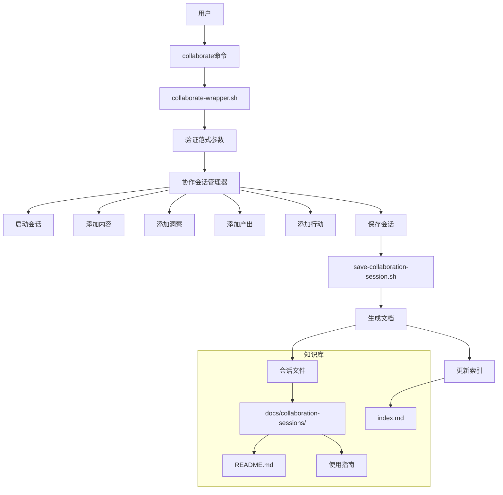
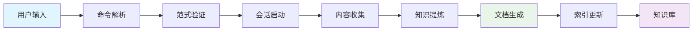
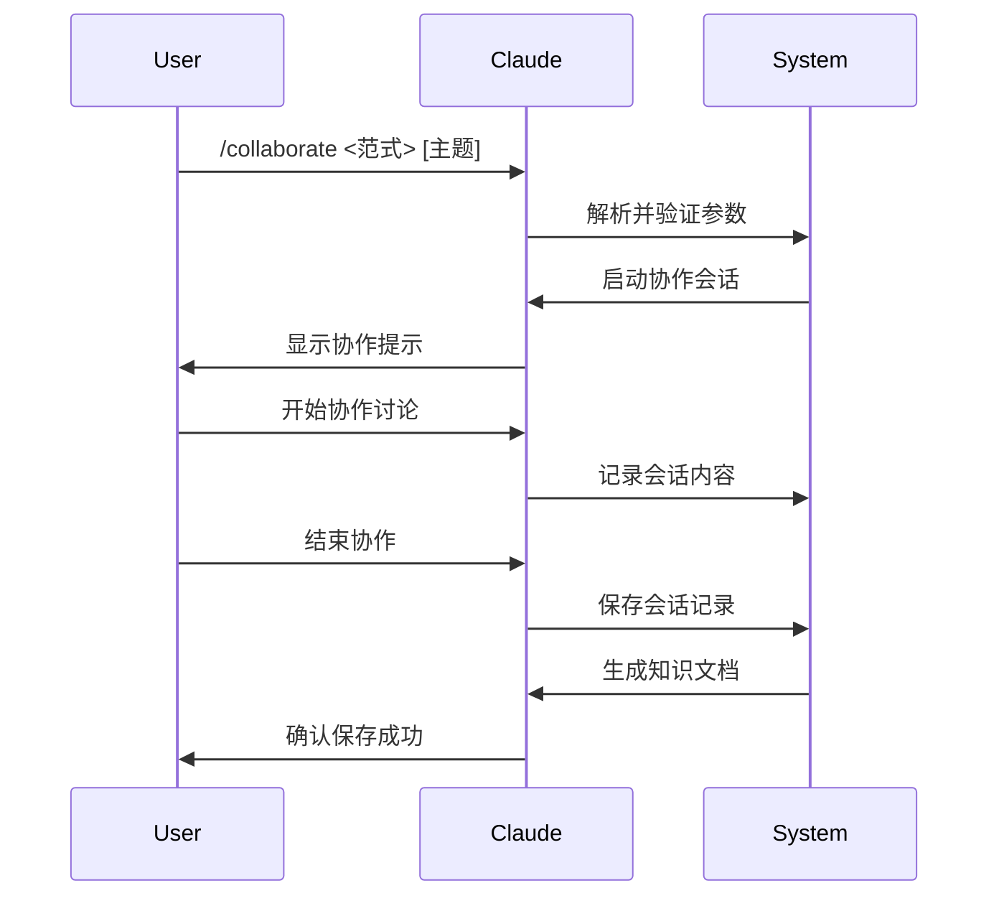

# AI协作系统架构图

## 系统概览



## 核心组件

### 1. 命令入口
- **文件**：`.claude/commands/collaborate.md`
- **功能**：定义命令语法和参数
- **特点**：支持12种协作范式，自动知识保存

### 2. 命令包装器
- **文件**：`.specify/scripts/bash/collaborate-wrapper.sh`
- **功能**：解析参数、验证范式、启动会话
- **特点**：智能提示、使用建议、错误处理

### 3. 会话管理器
- **文件**：`.specify/scripts/bash/collaboration-session-manager.sh`
- **功能**：跟踪会话状态、管理内容、保存会话
- **特点**：实时状态跟踪、结构化内容管理

### 4. 保存脚本
- **文件**：`.specify/scripts/bash/save-collaboration-session.sh`
- **功能**：生成Markdown文档、更新索引
- **特点**：模板化文档、自动索引维护

## 数据流



## 协作范式支持

### 基础范式 (8个)
- creative - 创意激发
- critical - 批判思考
- feynman - 费曼学习法
- first-principles - 第一性原理
- optimize - 流程优化
- progressive - 渐进沟通
- smart - 结构化表达
- visual - 可视化呈现

### 高级范式 (4个)
- ears - 需求描述
- evolve - 持续进化
- fusion - 跨界融合
- learning - 个性化学习

## 知识保存结构

```
docs/collaboration-sessions/
├── README.md                    # 使用说明
├── index.md                     # 会话索引
├── session-YYYYMMDD-HHMMSS.md   # 具体会话记录
└── collaboration-guide.md       # 详细使用指南
```

### 会话记录内容
1. **会话元信息**：ID、时间、范式、主题、用户
2. **范式说明**：协作方法的核心要点
3. **讨论内容**：对话记录、关键洞察
4. **产出成果**：解决方案、行动要点
5. **知识总结**：结构化提炼的核心知识

## 使用流程



## 扩展特性

### 1. 智能提示
- 根据不同范式提供使用建议
- 实时显示协作状态
- 错误处理和帮助信息

### 2. 灵活的内容管理
- 支持多种内容类型：讨论、洞察、产出、行动
- 实时状态跟踪
- 结构化数据组织

### 3. 自动化知识管理
- 模板化文档生成
- 自动索引维护
- 便于检索和复用

### 4. 可扩展架构
- 易于添加新的协作范式
- 支持自定义内容类型
- 模块化设计便于维护

---

*架构图生成时间：2025-10-06 13:28*