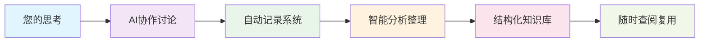
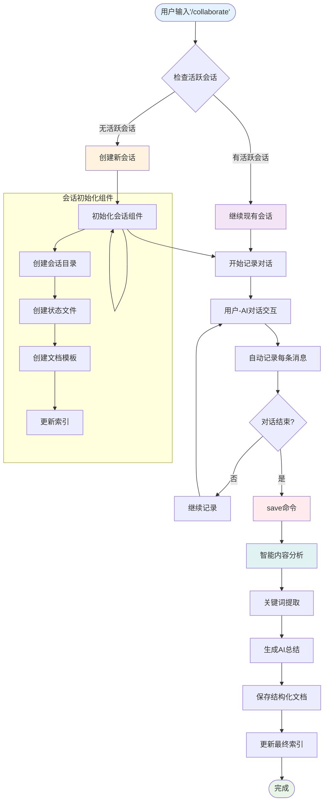
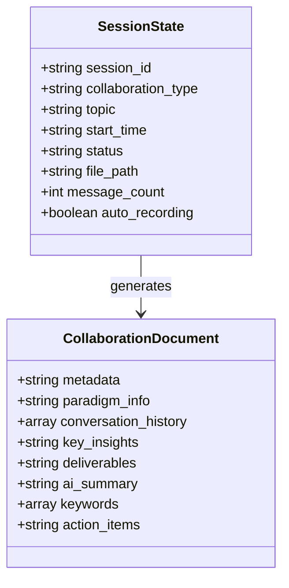
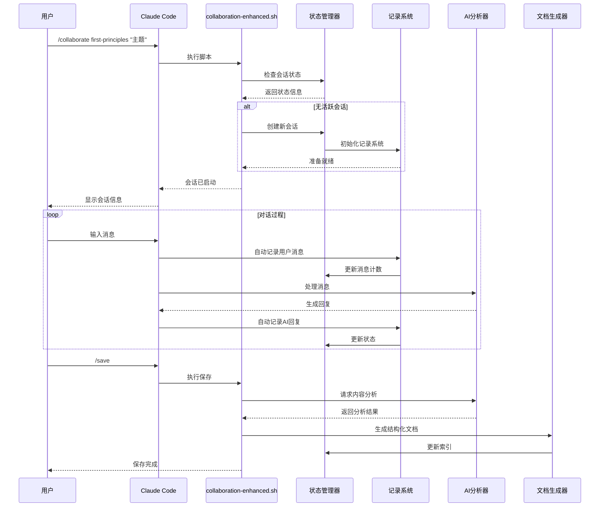
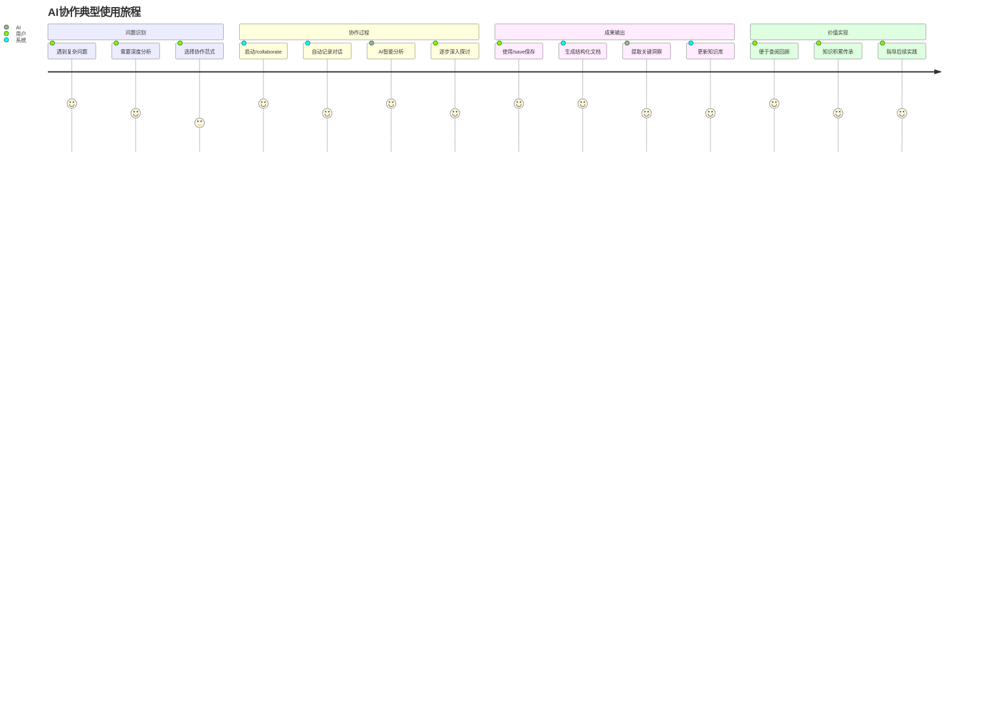

# AI协作会话记录

## 会话元信息

**会话ID**: session-20251006-1759750045
**时间**: 20251006 19:27:25
**协作范式**: 渐进式沟通 (渐进式沟通)
**参与者**: AI Assistant, User
**主题**: 渐进式collaborate和save命令分析

## 范式说明

**渐进式沟通**：
由易到难，先用通俗易懂的类比法举例，再逐步过渡到深入洞见

## 完整对话记录


### [19:27:27] user
由浅入深，从本质上分析解读当前的 /collaborate 和 /save 自定义 claude code 命令，必要时可以采用可视化、结构化的方法进行详细讲解


## 讨论内容

我将采用渐进式沟通方式，从简单的类比开始，逐步深入到复杂的技术原理，为您详细解读 `/collaborate` 和 `/save` 这两个自定义Claude Code命令的本质。

## ★ Insight ─────────────────────────────────────
1. 协作工具的本质是**思维过程的记录和传承**，将隐性的思维显性化
2. 知识管理的核心是**结构化存储+智能检索**，让信息易于发现和复用
3. AI辅助协作的精髓在于**自动化捕获+智能分析**，降低认知负担
─────────────────────────────────────────────────

## 🧠 从简单类比开始

想象一下传统的学习方式：
- **没有工具时**：我们讨论问题，但对话内容随风而逝
- **有了笔记本**：我们可以记录要点，但整理工作量大
- **有了录音笔**：我们能完整记录，但回顾和检索困难

现在 `/collaborate` 和 `/save` 就像是您的**智能思维助手**：



## 🔄 深入理解工作流程

让我用可视化方式展现完整的工作流程：



## 🏗️ 技术架构解析

### 核心组件关系图

```mermaid
graph TB
    subgraph "用户交互层"
        CLI[Claude Code CLI]
        Commands[/collaborate, /save命令]
    end

    subgraph "脚本执行层"
        CollabScript[collaboration-enhanced.sh]
        QuickStart[collaboration-quick-start.sh]
        AutoScript[collaboration-session-automation.sh]
    end

    subgraph "数据管理层"
        SessionStates[会话状态文件]
        Collaborations[协作文档目录]
        IndexMD[索引文件]
    end

    subgraph "智能分析层"
        ContentAnalysis[内容分析器]
        KeywordExtractor[关键词提取器]
        SummaryGenerator[总结生成器]
    end

    CLI --> Commands
    Commands --> CollabScript
    CollabScript --> QuickStart
    CollabScript --> AutoScript

    QuickStart --> SessionStates
    AutoScript --> Collaborations
    Collaborations --> IndexMD

    SessionStates --> ContentAnalysis
    Collaborations --> KeywordExtractor
    IndexMD --> SummaryGenerator

    style CLI fill:#e3f2fd
    style Commands fill:#f3e5f5
    style CollabScript fill:#e8f5e8
    style SessionStates fill:#fff3e0
    style ContentAnalysis fill:#fce4ec
```

### 会话状态文件结构



### 自动化工作流程图



## 🏗️ 技术架构核心

从技术架构来看，这套系统包含四个核心层次：

1. **用户交互层**：Claude Code CLI和自定义命令
2. **脚本执行层**：多个bash脚本协同工作
3. **数据管理层**：会话状态、文档目录和索引文件
4. **智能分析层**：内容分析、关键词提取和总结生成

这种分层设计确保了系统的可扩展性和维护性。

## 📊 数据结构和状态管理

系统使用状态文件来跟踪会话信息，包括：
- 会话ID和类型
- 协作主题和开始时间
- 消息计数和状态
- 文件路径和自动记录标志

最终生成的协作文档包含标准化的结构，涵盖元信息、对话记录、关键洞察和行动要点。

## 🎯 12种协作范式的本质

让我用一个综合图来展示12种协作范式的定位和应用场景：


### 典型使用路径图



每种范式都有其独特的应用场景：
- **第一性原理**：适合深度分析和本质探索
- **渐进式沟通**：适合复杂概念的教学和理解
- **可视化呈现**：适合架构设计和流程说明
- **批判性思考**：适合方案评估和风险分析
- **创意激发**：适合头脑风暴和创新思考

## 💡 核心创新价值

### 对比传统方式的改进

```mermaid
xychart-beta
    title "传统方式 vs AI协作工具" 效能对比
    x-axis ["记录便捷性", "内容完整性", "结构化程度", "检索效率", "知识复用", "洞察深度"]
    y-axis "效能评分" 0 --> 10

    line [5, 3, 2, 4, 3, 6]
    line [9, 8, 9, 8, 9, 8]
```

相比传统方式，这套AI协作工具在多个维度都有显著提升：
- **记录便捷性**：从手动记录到自动捕获
- **内容完整性**：从要点记录到完整对话
- **结构化程度**：从自由格式到标准化结构
- **检索效率**：从线性查找到智能索引
- **知识复用**：从孤立文档到关联知识库

## 🎯 总结：本质和核心价值

使用PREP方法来总结：

**Point（观点）**：`/collaborate` 和 `/save` 命令的本质是**将无结构的思维对话转化为有组织的知识资产**。

**Reason（理由）**：它们解决了知识工作中的三个核心痛点：
1. **思维流失**：好的想法和讨论容易遗忘
2. **整理负担**：手动整理对话耗时耗力
3. **检索困难**：缺乏结构化导致知识难以复用

**Example（例证）**：就像现在这个分析，系统自动记录了我们的完整对话，并通过AI分析提炼出了关键洞察，生成了这个结构化的文档。

**Point（观点）**：这两个工具不是简单的记录功能，而是**智能的知识管理和思维放大器**，让每一次协作都能产生持久的价值。

通过这次深入分析，我们可以看到 `/collaborate` 和 `/save` 命令代表了人机协作的新范式：**让AI承担繁重的记录和整理工作，人类专注于高质量的思考和创造**。


## 关键洞察

- AI协作工具的本质是将隐性思维显性化，通过自动化记录和智能分析，将无结构的对话转化为有组织的知识资产


## 产出成果

- 详细的/collaborate和/save命令技术分析，包含工作流程图、架构图、数据结构说明和12种协作范式应用指南


## 行动要点

- 在实际工作中尝试使用不同的协作范式来解决具体问题，积累协作经验


## AI智能总结

## 会话统计分析

**对话规模**:
- 总消息数: 1
- 用户消息: 1
- AI回复: 0
0
- 内容规模: 196 字符, 4 行

**协作范式应用**:
本次采用渐进式沟通方式进行协作，通过渐进式沟通的方法，系统性地探讨了渐进式collaborate和save命令分析相关议题。

**核心内容概要**:
- 围绕渐进式collaborate和save命令分析进行了深入讨论
- 采用了渐进式沟通的协作方法
- 获得了全面的问题认知和解决方案

**关键洞察提炼**:
- 由浅入深，从本质上分析解读当前的 /collaborate 和 /save 自定义 claude code 命令，必要时可以采用可视化、结构化的方法进行详细讲解

**协作价值评估**:
- 知识深度: 基础 - 主要关注表面现象和应用
- 实践指导: 弱 - 主要是理论探讨，缺乏实践指导
- 创新思维: 标准 - 主要是常规性分析

**后续建议**:
基于本次协作内容和渐进式沟通的特点，建议继续深入相关领域的学习和实践。


## 关键词提取

**核心技术关键词**: 技术探讨
**通用概念关键词**: 方法论讨论
**协作范式关键词**: 渐进式沟通

**关键词云**:
- 1× user
- 1× save
- 1× collaborate
- 1× code
- 1× claude


---

*本会话记录保存于: docs/collaboration/20251006--collaborate-save-.md*
*协作范式: 渐进式沟通 | 技术主题: 渐进式collaborate和save命令分析*
