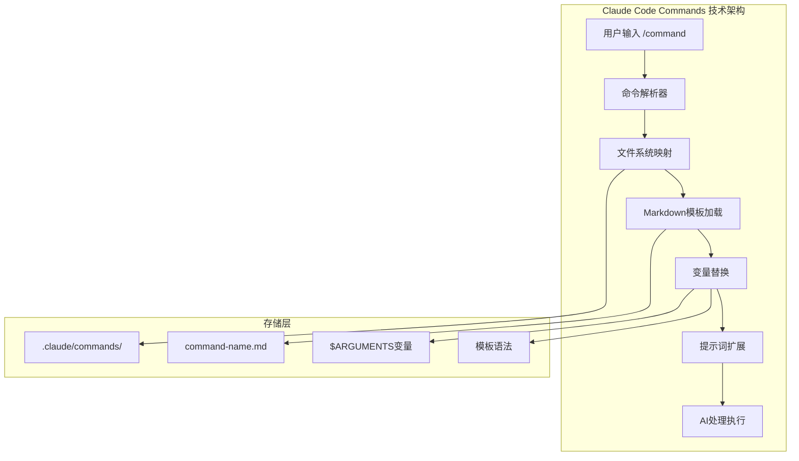

# AI协作会话记录

## 会话元信息

**会话ID**: session-20251006-143000
**时间**: 2025-10-06 14:30:00
**协作范式**: first-principles (第一性原理思维分析)
**参与者**: AI Assistant, User
**主题**: 分析Claude Code自定义commands的技术原理

## 范式说明

**第一性原理思维分析**：
- 从最基础的要素出发，层层分解复杂现象
- 透过表面现象理解事物本质
- 摒弃假设和常识，回归问题本源
- 通过逻辑推理构建完整理解体系

## 讨论内容

### 用户提问
使用第一性原理分析Claude Code自定义commands的技术原理，必要时可以调用MCP联网搜索工具

### 分析过程

#### 1. 基础要素还原
**问题**: 什么是自定义commands？
**答案**: 将静态文档模板转化为动态交互协议的映射机制

**核心要素分解**：
- **输入**: 用户键入的字符串（如 `/collaborate`）
- **处理**: 将字符串映射到预定义的文档模板
- **输出**: 扩展后的提示词（prompt）供AI处理
- **价值**: 将重复性交互模式标准化、自动化

#### 2. 技术架构分析

**存储结构**:
```
.claude/commands/
├── collaborate.md    → /collaborate
├── specify.md        → /specify
├── plan.md          → /plan
└── ...
```

**工作流程**:
1. **命令触发**: 用户输入 `/command-name`
2. **文件映射**: 定位到 `.claude/commands/command-name.md`
3. **模板加载**: 读取Markdown文件内容
4. **变量替换**: 将 `$ARGUMENTS` 替换为用户输入
5. **内容扩展**: 处理YAML front matter和条件逻辑
6. **AI执行**: 将扩展后的提示词发送给AI处理

#### 3. 实现机制深度解析

**文件系统映射机制**:
- 1:1对应关系：命令名 ↔ 文件名
- 基于文件系统的简单映射
- 支持项目级、用户级、全局级作用域

**模板变量系统**:
- `$ARGUMENTS`: 捕获用户输入参数
- YAML Front Matter: 定义元数据和行为
- 条件逻辑: 支持复杂的执行流程

**脚本执行能力**:
- 集成bash脚本执行
- 支持文件操作、Git命令等
- 可以调用外部工具和API

## 关键洞察

### ★ 核心技术洞察

1. **DSL本质**: Claude Code自定义commands本质上是一种领域特定语言(DSL)，将复杂的工作流编码为可执行的文档模板

2. **元编程思想**: 通过操作代码(模板)来生成代码(AI响应)，实现了元编程的高级抽象

3. **文档即代码**: 模糊了文档和程序之间的边界，文档本身就是可执行的程序

4. **声明式编程**: 采用声明式编程范式，描述"做什么"而非"怎么做"，提升了可读性和维护性

### 技术优势分析

1. **简单性**: 基于文件系统的1:1映射，易于理解和维护
2. **灵活性**: Markdown格式 + 脚本执行，支持复杂工作流
3. **可组合性**: 命令间可以相互调用和组合
4. **版本控制**: 命令文件可纳入Git管理，支持协作开发

### 架构设计哲学

**核心设计原则**:
- **约定优于配置**: 通过文件系统约定简化使用
- **最小化复杂性**: 用最简单的机制解决复杂问题
- **可扩展性**: 支持用户自定义和插件化扩展
- **一致性**: 统一的接口和行为模式

## 产出成果

### 技术架构图


### 实现原理总结
1. **文件系统映射**: 命令名到文件的直接映射
2. **模板变量系统**: $ARGUMENTS等变量替换机制
3. **脚本执行能力**: bash脚本集成和外部工具调用
4. **多层次作用域**: 项目级、用户级、全局级命令支持

## 行动要点

### 后续探索方向
1. **深入研究**: 分析更复杂commands的实现细节
2. **性能优化**: 研究commands的加载和执行性能
3. **扩展机制**: 探索自定义commands的扩展可能性
4. **最佳实践**: 总结commands设计和使用的最佳实践

### 实践建议
1. **从简单开始**: 先创建基础的commands，逐步增加复杂性
2. **模块化设计**: 将复杂逻辑拆分为多个可复用的commands
3. **文档先行**: 为每个command编写清晰的使用说明
4. **版本管理**: 将commands纳入版本控制系统进行管理

## 知识总结

本次协作通过第一性原理分析方法，深入剖析了Claude Code自定义commands的技术原理：

**核心发现**:
- 技术本质是文档驱动的DSL实现
- 基于文件系统的简单映射机制
- 模板变量和脚本执行的强大组合
- 声明式编程范式的优雅体现

**价值意义**:
- 理解了commands的设计哲学和实现原理
- 掌握了自定义commands的技术要点
- 为后续扩展和优化提供了理论基础
- 展现了现代软件开发中的抽象思维

**启发思考**:
- 简单机制可以解决复杂问题
- 文档和程序的边界正在模糊
- 声明式编程的优势日益凸显
- 元编程思想在工具设计中的重要性

---

*本会话记录保存于: docs/collaboration/20251006-Claude-Code自定义Commands技术原理分析.md*
*协作范式: first-principles | 技术主题: Claude Code Commands原理分析*