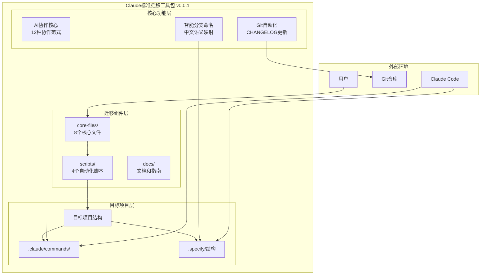
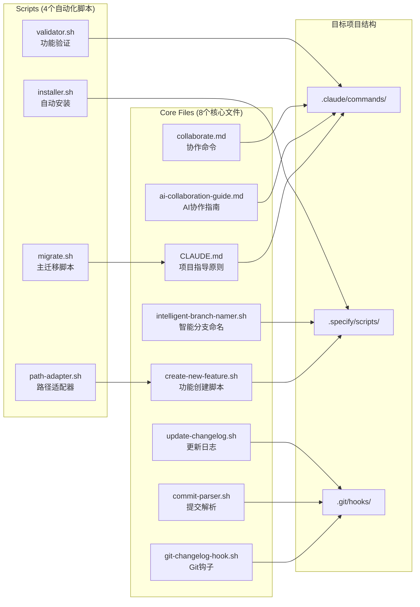
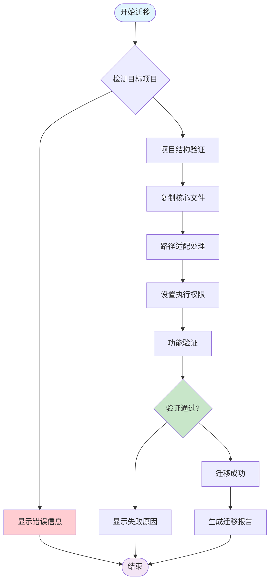
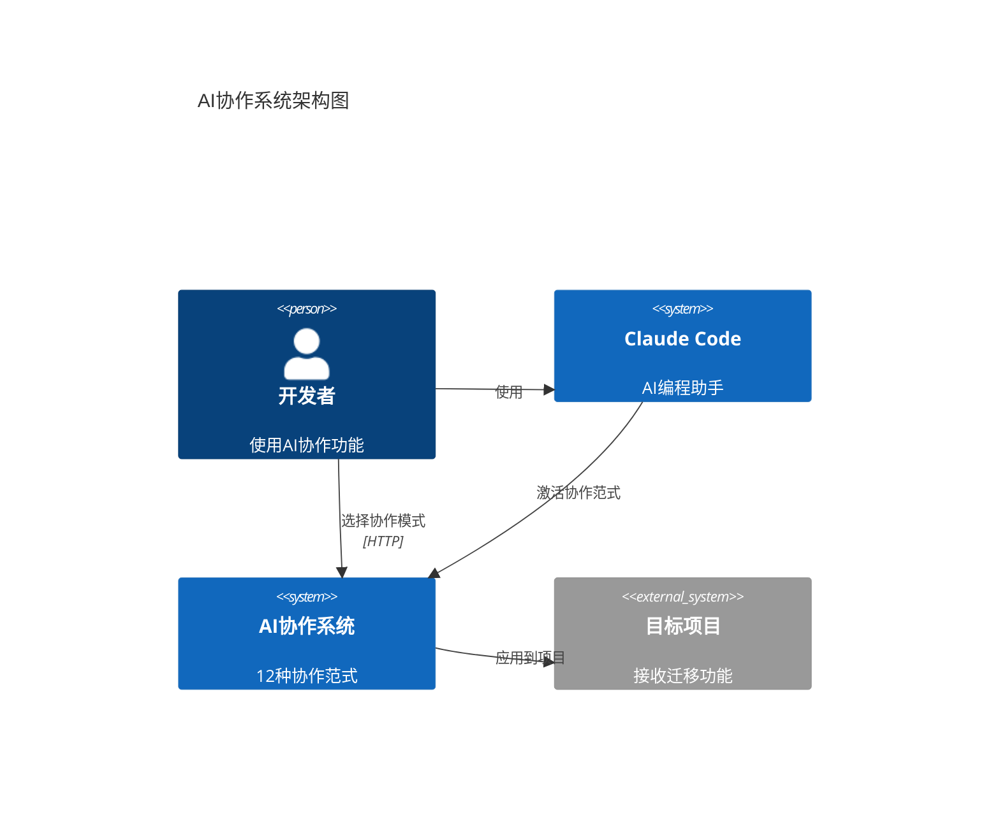
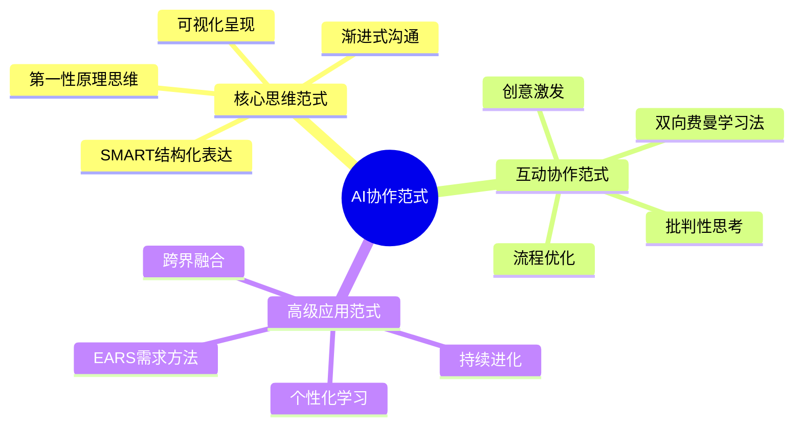
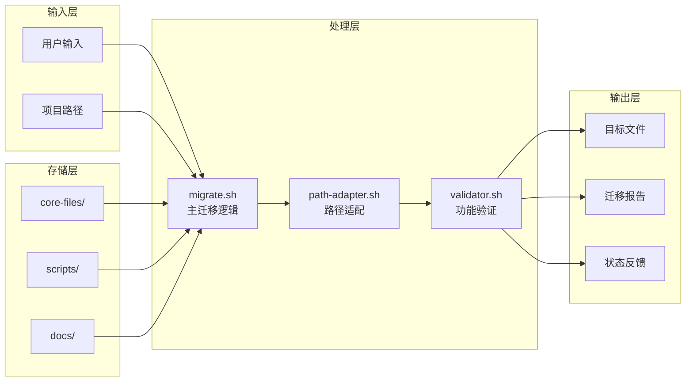

# 🎨 项目整体架构可视化分析协作会话

## 会话元信息

**会话ID**: session-20251006-1759732695
**时间**: 2025-10-06 14:38:15
**协作范式**: 可视化呈现 (Visual)
**参与者**: AI Assistant, User
**主题**: 当前项目的整体架构分析

## 范式说明

**可视化呈现 (Visual)**：
整合思维导图、架构图、流程图、状态图、实体关系图、甘特图、饼图、用户旅程图、象限图、需求图、时间线、数据包图、看板图、雷达图、GitGraph图、ZenUML图、Sankey图、C4 Diagrams、XY Chart、Block Diagrams等Mermaid图表进行直观讲解。

## ★ Insight 核心洞察

1. **三层架构设计**：项目采用核心功能层、迁移组件层、目标项目层的清晰分层架构
2. **智能适配机制**：通过自动化脚本实现从源码到目标项目的智能迁移和适配
3. **协作范式体系**：12种AI协作范式形成完整的人机协作方法论体系

## 讨论内容与可视化分析

### 1. 项目识别与基础分析

通过分析README.md和核心目录结构，识别出这是一个**Claude标准迁移工具包 v0.0.1**项目，主要功能包括：

- **AI协作核心** - 12种AI协作范式和激活器
- **智能分支命名** - 中文语义到英文的智能映射
- **Git自动化** - 自动CHANGELOG更新和提交解析
- **实践指南** - 详细的AI协作使用指导

### 2. 整体架构可视化分析

#### 三层架构设计图

**架构特点分析**：
- **模块化设计**：每个层级职责清晰，便于维护和扩展
- **标准化接口**：遵循.claude/和.specify/的行业标准
- **自动化流程**：通过脚本实现组件间的无缝集成

### 3. 核心文件组件详细分析

#### 核心文件组件图

**文件功能分析**：
- **配置文件**：CLAUDE.md、ai-collaboration-guide.md提供项目指导
- **功能脚本**：create-new-feature.sh、intelligent-branch-namer.sh实现核心功能
- **自动化工具**：Git相关脚本实现版本控制自动化
- **迁移脚本**：migrate.sh等实现跨项目迁移

### 4. 迁移工作流程可视化

#### 自动化迁移流程图

**流程关键节点**：
1. **项目检测**：验证目标项目的结构和兼容性
2. **文件复制**：将8个核心文件复制到目标位置
3. **路径适配**：自动调整文件中的路径引用
4. **权限设置**：确保脚本具有执行权限
5. **功能验证**：验证迁移后的功能完整性

### 5. AI协作系统架构分析

#### C4系统架构图

**系统交互分析**：
- **用户交互层**：开发者通过Claude Code使用AI协作功能
- **协作系统层**：提供12种协作范式的核心实现
- **目标项目层**：接收并应用迁移后的功能

### 6. 协作范式分类体系

#### 12种协作范式思维导图

**范式分类解析**：
- **核心思维范式**：提供基础思维方法和分析框架
- **互动协作范式**：实现人机交互的协作模式
- **高级应用范式**：针对特定专业领域的应用方法

### 7. 数据流架构分析

#### 系统数据流图

## 关键技术洞察

### 架构设计优势
1. **高内聚低耦合**：各组件职责明确，接口标准化
2. **可扩展性强**：基于模板的设计模式，易于添加新功能
3. **自动化程度高**：从迁移到验证的全流程自动化
4. **跨平台兼容**：支持不同的操作系统和Shell环境

### 技术实现特点
1. **智能路径适配**：动态检测项目结构并调整路径引用
2. **模块化脚本设计**：每个脚本功能单一，便于维护
3. **完整的状态管理**：记录迁移过程的所有关键信息
4. **自动化验证机制**：确保迁移后的功能完整性

## 产出成果

### 可视化文档产出
- ✅ 三层架构设计图
- ✅ 核心文件组件图
- ✅ 自动化迁移流程图
- ✅ C4系统架构图
- ✅ 协作范式思维导图
- ✅ 系统数据流图

### 技术分析成果
- ✅ 完整的项目架构分析
- ✅ 核心组件功能解析
- ✅ 工作流程优化建议
- ✅ 系统交互关系梳理

## 行动要点

### 后续优化建议
1. **完善错误处理**：增加更详细的错误诊断和恢复机制
2. **扩展协作范式**：根据实际使用反馈，开发新的协作范式
3. **优化迁移性能**：提升大项目的迁移速度和效率
4. **增强可视化**：添加更多类型的图表和展示方式

### 知识管理建议
1. **建立架构文档库**：将所有可视化分析归档管理
2. **创建最佳实践指南**：总结架构设计的经验教训
3. **定期更新文档**：随着项目演进及时更新架构分析
4. **分享技术洞察**：将分析结果分享给团队和社区

## 知识总结

本次可视化架构分析协作会话，通过系统性的图表分析和深度技术洞察，全面解析了Claude标准迁移工具包的整体架构：

**核心发现**：
- 识别出三层架构设计模式及其技术优势
- 梳理了12种AI协作范式的分类体系和应用场景
- 分析了自动化迁移工作流的关键节点和优化空间

**价值意义**：
- 为项目的技术架构优化提供了可视化依据
- 建立了完整的知识体系文档，便于后续参考
- 展示了可视化协作范式的实际应用效果

**启发思考**：
- 可视化分析方法能够有效提升复杂系统的理解效率
- 模块化架构设计是提升系统可维护性的关键
- AI协作范式为软件开发提供了新的工作模式

---

*本会话记录保存于: docs/collaboration/20251006-项目整体架构可视化分析.md*
*协作范式: 可视化呈现 | 技术主题: 项目整体架构分析*
*会话ID: session-20251006-1759732695*