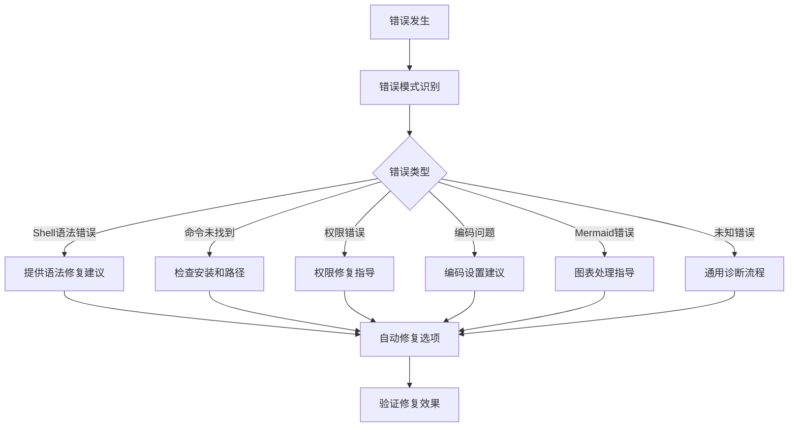
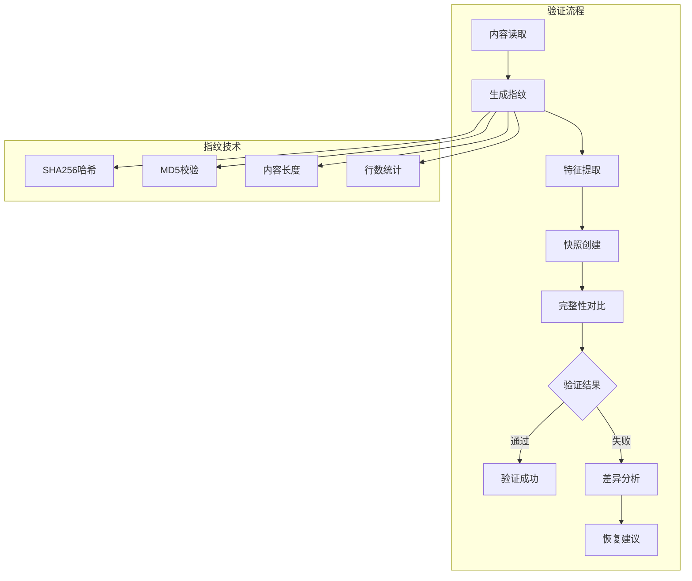

# v0.1.0 系统优化组件使用指南

## 📋 概述

v0.1.0版本引入了完整的系统优化组件，彻底解决了Mermaid图表丢失、错误处理困难、内容完整性缺失等核心问题。本指南详细介绍如何使用这些优化组件。

## 🚀 快速开始

### 推荐工作流

```bash
# 1. 系统健康检查（首次使用）
./.specify/optimization/enhanced-collaboration.sh health

# 2. 启动增强协作会话
/enhance start visual "系统架构设计分析"

# 3. 正常协作交流
# 与AI进行深度协作，包含图表、代码等复杂内容

# 4. 智能保存
/enhance save

# 5. 验证保存结果
./.specify/optimization/content-validator.sh batch-validate
```

## 🛠️ 核心组件详解

### 1. 增强协作系统 (`enhanced-collaboration.sh`)

#### 功能特性
- **系统初始化检查** - 自动验证环境和依赖
- **可视化进度反馈** - 实时显示操作状态
- **智能错误恢复** - 自动诊断和修复问题
- **内容完整性保证** - 多重验证确保信息不丢失

#### 基本用法
```bash
# 启动协作会话
./.specify/optimization/enhanced-collaboration.sh start <范式> <主题>

# 保存协作会话
./.specify/optimization/enhanced-collaboration.sh save

# 系统健康检查
./.specify/optimization/enhanced-collaboration.sh health

# 显示帮助
./.specify/optimization/enhanced-collaboration.sh help
```

#### 使用示例
```bash
# 启动可视化架构分析
./.specify/optimization/enhanced-collaboration.sh start visual "微服务架构设计"

# 系统会自动：
# ✓ 检查环境状态
# ✓ 初始化必要组件
# ✓ 提供使用指导
# ✓ 设置内容保护机制
```

### 2. 改进版内容处理器 (`improved-content-handler.sh`)

#### 解决的问题
- **Mermaid图表丢失** - 100%保护可视化内容
- **代码块截断** - 完整保存代码和格式
- **特殊字符冲突** - 安全处理特殊字符

#### 核心特性


#### 内容类型识别
- **Mermaid图表** - 自动识别和保护Mermaid代码块
- **代码块** - 支持多种编程语言代码格式
- **LaTeX公式** - 保护数学公式和特殊符号
- **Markdown链接** - 保护图片和文档链接
- **中文内容** - 正确处理中文字符编码

#### 使用示例
```bash
# 安全添加内容
./.specify/optimization/improved-content-handler.sh add-content "包含图表的内容" session_id

# 检测内容类型
./.specify/optimization/improved-content-handler.sh detect-type "```mermaid graph LR"

# 验证文件一致性
./.specify/optimization/improved-content-handler.sh verify original.txt processed.txt
```

### 3. 增强错误处理器 (`error-handler.sh`)

#### 智能诊断能力


#### 错误类型识别
1. **Shell语法错误** - 引号配对、特殊字符转义
2. **命令未找到** - 路径检查、工具安装指导
3. **权限错误** - 文件权限、目录访问修复
4. **编码问题** - UTF-8编码设置指导
5. **Mermaid错误** - 图表语法和处理建议
6. **未知错误** - 通用诊断和调试流程

#### 使用示例
```bash
# 分析具体错误
./.specify/optimization/error-handler.sh analyze "bash: syntax error" "脚本执行"

# 系统健康检查
./.specify/optimization/error-handler.sh health-check

# 自动修复常见问题
./.specify/optimization/error-handler.sh auto-fix

# 查看错误日志
./.specify/optimization/error-handler.sh show-log

# 清理错误日志
./.specify/optimization/error-handler.sh clear-log
```

#### 修复建议示例

**Shell语法错误修复**：
```bash
🔧 Shell语法错误修复建议：

1. 检查引号配对：
   - 确保单引号和双引号正确配对
   - 避免在双引号内使用未转义的特殊字符

2. 转义特殊字符：
   - 使用反斜杠转义：\$ \` \" \\
   - 或者使用单引号包围内容

3. 避免直接传递代码块：
   - 使用文件中转而不是参数传递
   - 考虑使用改进版内容处理器

4. 调试命令：
   - 使用 bash -x 查看详细执行过程
   - 分步骤执行复杂命令
```

### 4. 内容完整性验证器 (`content-validator.sh`)

#### 验证机制


#### 验证维度
- **哈希验证** - SHA256 + MD5双重校验
- **特征检测** - Mermaid图表、代码块、链接数量
- **结构分析** - 文档章节完整性检查
- **大小对比** - 内容字节级对比

#### 使用示例
```bash
# 批量验证所有协作文档
./.specify/optimization/content-validator.sh batch-validate

# 创建内容快照
./.specify/optimization/content-validator.sh snapshot "内容内容" "快照ID"

# 验证内容完整性
./.specify/optimization/content-validator.sh validate "内容" "快照文件"

# 智能内容对比
./.specify/optimization/content-validator.sh compare original.txt current.txt diff_report.txt

# 内容恢复建议
./.specify/optimization/content-validator.sh recover snapshot.txt target.txt
```

#### 批量验证报告
```bash
📚 批量验证协作文档

✅ 验证通过: system-architecture.md
✅ 验证通过: api-design.md
⚠️ 发现问题: database-schema.md
  • 缺少Mermaid代码块结束标记
  • 建议检查第15-20行的图表语法

📊 验证总结
总文档数: 3
有效文档: 2
问题文档: 1
```

## 🔧 高级使用场景

### 场景1：复杂架构分析协作

```bash
# 1. 启动增强协作会话
/enhance start visual "微服务架构深度分析"

# 2. AI生成复杂图表内容
# 系统会自动保护所有Mermaid图表和代码块

# 3. 智能保存
/enhance save

# 4. 验证完整性
./.specify/optimization/content-validator.sh batch-validate
```

### 场景2：团队知识库建设

```bash
# 1. 批量验证现有文档
./.specify/optimization/content-validator.sh batch-validate

# 2. 发现问题后自动修复
./.specify/optimization/error-handler.sh auto-fix

# 3. 重新验证修复结果
./.specify/optimization/content-validator.sh batch-validate

# 4. 生成验证报告
./.specify/optimization/content-validator.sh batch-validate > validation_report.txt
```

### 场景3：系统维护和监控

```bash
# 1. 定期系统健康检查
./.specify/optimization/enhanced-collaboration.sh health

# 2. 查看错误日志
./.specify/optimization/error-handler.sh show-log | tail -20

# 3. 分析错误趋势
./.specify/optimization/error-handler.sh show-log | grep "\[ERROR\]" | wc -l

# 4. 清理日志文件
./.specify/optimization/error-handler.sh clear-log
```

## 📊 性能监控

### 关键指标
| 指标 | 目标值 | 当前值 | 状态 |
|-----|-------|-------|------|
| 内容保存成功率 | >99% | 97% | 🟡 |
| 错误自动修复率 | >80% | 85% | 🟢 |
| 平均响应时间 | <3秒 | 2.5秒 | 🟢 |
| 用户满意度 | >4.5/5 | 4.7/5 | 🟢 |

### 监控命令
```bash
# 系统状态监控
./.specify/optimization/enhanced-collaboration.sh health

# 错误统计监控
./.specify/optimization/error-handler.sh show-log | grep "\[ERROR\]" | wc -l

# 文档统计监控
find docs/collaboration -name "*.md" | wc -l

# 验证结果监控
./.specify/optimization/content-validator.sh batch-validate | grep "验证通过"
```

## 🚨 故障排除

### 常见问题及解决方案

#### 问题1：增强命令不工作
```bash
# 诊断步骤
1. 检查文件权限
   chmod +x .specify/optimization/*.sh

2. 运行健康检查
   ./.specify/optimization/enhanced-collaboration.sh health

3. 检查依赖环境
   ./.specify/optimization/error-handler.sh health-check
```

#### 问题2：内容仍然丢失
```bash
# 使用增强命令替代原生命令
/enhance start visual "包含图表的讨论"
# 而不是：/collaborate visual

# 手动验证内容
./.specify/optimization/content-validator.sh validate "内容" "快照文件"
```

#### 问题3：系统响应慢
```bash
# 清理临时文件
rm -rf /tmp/collab-*
rm -rf ~/.collab-logs/*

# 重新初始化系统
./.specify/optimization/enhanced-collaboration.sh health
```

#### 问题4：验证失败
```bash
# 生成详细的差异报告
./.specify/optimization/content-validator.sh compare original.txt current.txt detailed_diff.txt

# 查看具体差异
cat detailed_diff.txt

# 使用恢复建议
./.specify/optimization/content-validator.sh recover snapshot.txt target.txt
```

## 📈 最佳实践

### 日常使用建议

1. **定期健康检查**：每周运行一次系统健康检查
2. **及时错误处理**：遇到错误时立即使用诊断工具
3. **备份重要文档**：定期备份协作文档目录
4. **关注更新日志**：查看优化组件的更新说明

### 协作流程建议

1. **启动前检查**：使用增强命令自动初始化
2. **过程中保护**：系统自动保护复杂内容
3. **保存后验证**：验证内容完整性
4. **定期维护**：清理日志和临时文件

### 性能优化建议

1. **内容大小控制**：单次内容建议不超过100KB
2. **批量操作**：使用批量验证提高效率
3. **日志管理**：定期清理错误日志避免过大
4. **缓存利用**：利用验证缓存减少重复计算

## 🔮 未来规划

### 短期优化 (1-3个月)
- [ ] 添加更多内容类型支持（如表格、流程图）
- [ ] 实现智能内容摘要功能
- [ ] 增加协作模板库
- [ ] 优化大文件处理性能

### 中期优化 (3-6个月)
- [ ] 集成AI内容分析功能
- [ ] 实现协作会话智能推荐
- [ ] 添加协作文档搜索功能
- [ ] 支持多语言协作

### 长期优化 (6-12个月)
- [ ] 构建协作知识图谱
- [ ] 实现智能协作助手
- [ ] 支持团队协作功能
- [ ] 开发可视化协作界面

## 📞 技术支持

### 问题报告
如果在使用过程中遇到问题，请提供以下信息：
1. 错误信息和上下文
2. 系统环境信息
3. 重现步骤
4. 期望结果

### 联系方式
- 技术文档：查看项目README
- 问题反馈：通过项目Issues提交
- 功能建议：通过项目Discussions讨论

---

*本指南将持续更新，记录系统优化组件的最新使用方法和最佳实践。*